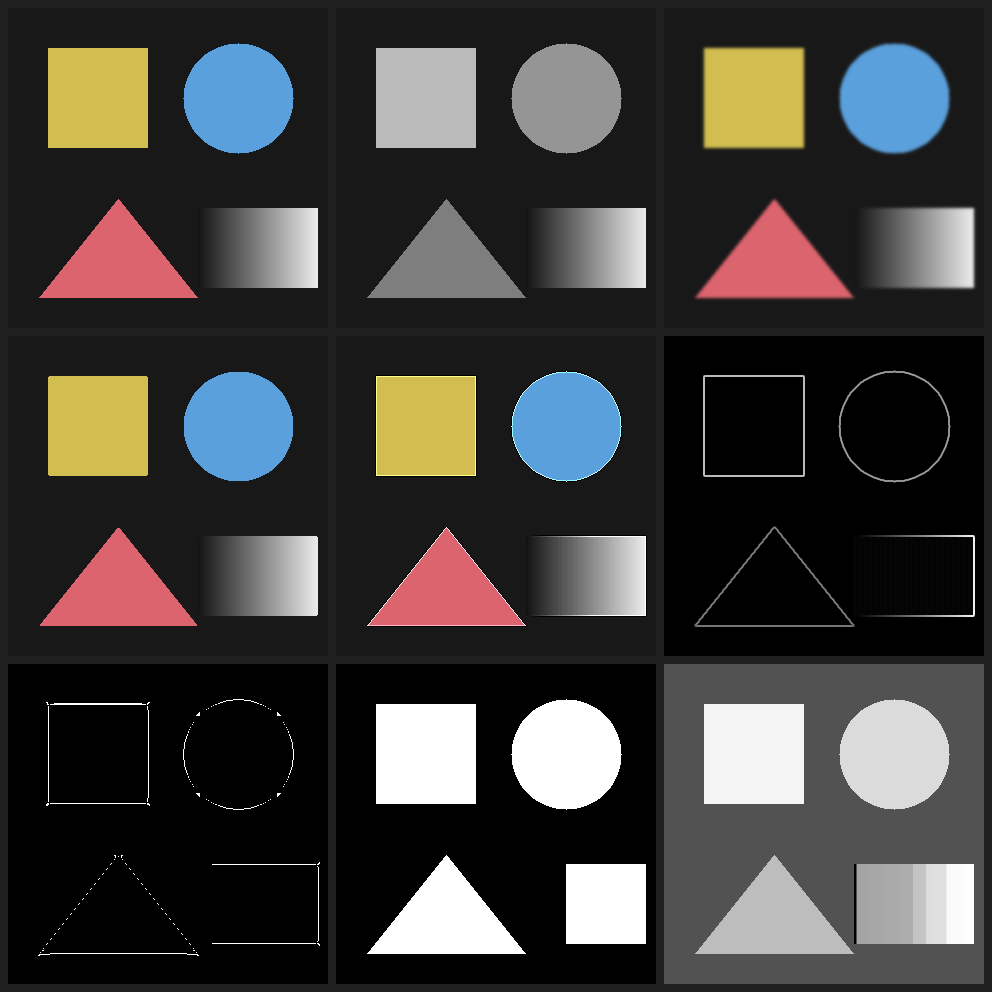

# imgkit

Image processing written out: 2D convolution, Gaussian and median filters, Otsu
thresholding and Canny-style edge detection. NumPy holds the arrays and Pillow
decodes the files; every operation in between is implemented here.



*Original, then grayscale, blur, median, sharpen, gradient magnitude, edges,
Otsu threshold and histogram equalisation — produced by `imgkit sheet`.*

- **42 tests**, Python 3.10–3.12
- Sample images are generated from a fixed seed, so every pixel is known and a
  test can assert what a filter should do to it

## Quick start

```bash
git clone https://github.com/umer-78/image-toolkit.git
cd image-toolkit
pip install -e ".[dev]"
pytest -q                                          # 42 tests

imgkit info  data/shapes.png
imgkit sheet data/shapes.png -o reports/contact-sheet.png
imgkit apply data/shapes-noisy.png median -o clean.png
imgkit apply data/shapes.png edges -o outline.png
imgkit bench data/shapes.png --sigma 4
```

## Convolution is not correlation

Almost every "convolution" in image-processing code is really correlation: the
kernel is slid over the image and multiplied in place, with no flip. For a
symmetric kernel — a box blur, a Gaussian — the two are identical and nobody
notices. For an asymmetric one, a Sobel operator above all, the result has the
**opposite sign**, and a gradient that points the wrong way is a bug that
survives for years because the magnitude still looks right.

```python
correlate(image, sobel_x()) == -convolve(image, sobel_x())   # True
```

Both are available, named for what they do, and a test pins that identity.

## Separable kernels

A Gaussian is an outer product: `G(x, y) = g(x)·g(y)`. That means a 2D pass can
be replaced by two 1D passes — `O(k)` work per pixel instead of `O(k²)`:

```
$ imgkit bench data/shapes.png --sigma 4
320x320 image, sigma 4.0, 25x25 kernel
  full 2D        164.4 ms   625 multiplies per pixel
  separable       11.3 ms   50 multiplies per pixel
  speed-up        14.5x
  largest difference between the two results: 1.71e-13
```

Timings are from one run on one machine and will differ on yours; the two
multiply counts and the last line will not.

That last line is the point. An optimisation that changes the answer is not an
optimisation, and a test asserts the two outputs agree to floating-point
precision. `is_separable` checks the property by matrix rank and `separate`
recovers the two halves by SVD, so it works for any rank-one kernel and not just
the ones that happen to be hard-coded.

## Four more decisions

**Grayscale weights green most.** `0.2126R + 0.7152G + 0.0722B`, not `(R+G+B)/3`.
The even average is the usual shortcut and it is wrong in a way you can see: it
turns a green field and a blue sky into the same grey.

**Padding reflects, it does not fill with black.** Zeros put a hard black edge
just outside the picture, and every edge detector then reports a strong edge all
the way around the frame.

**Otsu's threshold lands in the middle of the valley.** On an image with two
clean peaks, every cut in the empty space between them scores identically, and a
plain `argmax` returns the first — a threshold sitting right against the darker
peak, which the first speck of noise pushes over. Taking the middle of the tied
range puts it where it belongs. On a uniform gradient it returns 127.5, which is
the analytically correct answer and a test that fails if the arithmetic drifts.

**Edge thresholds are fractions of the image's own strongest gradient.** An
absolute threshold tuned on a bright photograph finds nothing at all in a dim
one. A test detects the same square at brightness 240 and at brightness 30 and
requires a comparable number of edge pixels.

## Edge detection, step by step

```
blur → gradients → non-maximum suppression → hysteresis
```

**Non-maximum suppression** is the step people skip. A Sobel magnitude marks a
wide band either side of every edge; keeping only pixels that are a local maximum
*along the gradient direction* turns that band into a line. Skipping it is why
homemade edge detectors produce fat, smeared outlines.

**Hysteresis** uses two thresholds instead of one. A single threshold either
breaks long contours into dashes or lets noise through; keeping strong edges plus
any weak edge that touches one holds a faint but real contour together while
dropping isolated specks. A test builds a row with a connected weak edge and an
isolated one and requires exactly the first to survive.

## Salt and pepper

A single white pixel drags a mean with it, so a blur spreads the speck into a
grey smudge. A median ignores it entirely as long as it is outnumbered:

```python
image[10, 10] = 255.0                    # one bright speck on a flat grey field
median_filter(image, 3)[10, 10]          # 50.0 — gone
blur(image, 1.0)[10, 10]                 # 82.6 — smeared
```

On `data/shapes-noisy.png`, which carries 2% salt and 2% pepper, a 3×3 median
brings the mean absolute error against the clean original down by more than a
factor of three. That is a test, not a claim.

## The pieces

```
src/imgkit/convolve.py   correlate, convolve, separable passes, padding modes
src/imgkit/kernels.py    box, Gaussian, Sobel, Prewitt, Laplacian, sharpen, emboss
src/imgkit/filters.py    grayscale, blur, median, gradients, Otsu, equalise, edges
src/imgkit/imageio.py    read, write, contact sheets
src/imgkit/cli.py        the `imgkit` command
data/                    three generated images
tools/make_images.py     the generator; CI fails if the output drifts
tests/                   42 tests
```

## As a library

```python
import numpy as np
from imgkit import read, write, edges, median_filter, threshold

image = read("data/shapes-noisy.png")

clean = median_filter(image, size=3)
outline = edges(clean, sigma=1.4, low=0.1, high=0.25)
binary = threshold(clean.mean(axis=2))          # Otsu picks the level

write(np.hstack([outline, binary]), "compare.png")
```

## Not included

Colour space conversion beyond luminance, morphological operations, feature
detectors, resampling, JPEG-aware processing, anything learned. What is here is
the arithmetic underneath all of that, written so it can be read.

## Licence

MIT — see [LICENSE](LICENSE).
